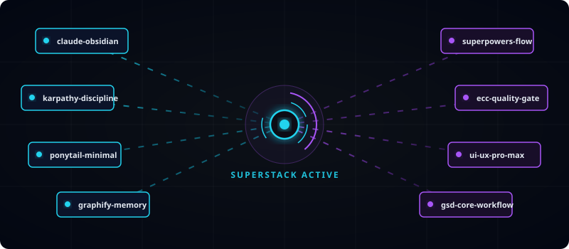
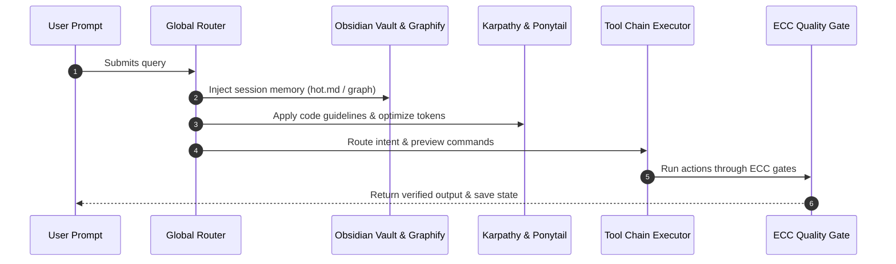

# claude_superstack

<p align="center">
  
</p>

<p align="center">
  
  
  
  
  
</p>

**One command. Ten frameworks. Every project.**

Turns Claude Code into an integrated, memory-backed, self-optimizing dev environment by unifying 10 open-source frameworks under one global router:

| Layer | Repos |
|---|---|
| Knowledge/Memory | [claude-obsidian](https://github.com/AgriciDaniel/claude-obsidian) · [obsidian-skills](https://github.com/kepano/obsidian-skills) · [graphify](https://github.com/Graphify-Labs/graphify) |
| Discipline | [andrej-karpathy-skills](https://github.com/multica-ai/andrej-karpathy-skills) |
| Minimalism / tokens | [ponytail](https://github.com/DietrichGebert/ponytail) |
| Workflow | [superpowers](https://github.com/obra/superpowers) · [gsd-core](https://github.com/open-gsd/gsd-core) |
| Quality | [ECC](https://github.com/affaan-m/ECC) |
| Design | [ui-ux-pro-max-skill](https://github.com/nextlevelbuilder/ui-ux-pro-max-skill) · [open-design](https://github.com/nexu-io/open-design) (optional) |

## Repository Stats (Live Updates)

<!-- STATS_START -->
| Metric | Value | Description |
|---|---|---|
| **SuperStack Version** | `v1.1.0` | Current release version |
| **Integrated Frameworks** | `10` | Unified Claude Code extensions |
| **Automation Scripts** | `4 files` (896 lines) | Core installation & orchestration |
| **Documentation Assets** | `6 guides` | Deep-dives, manuals, and schemas |
| **Last Auto-Updated** | `2026-07-26` | Triggered by latest repository push |
<!-- STATS_END -->

## Feature & Compatibility Matrix

| Feature Layer | Integrated Tool | Main Responsibility | Status |
|---|---|---|---|
| **Memory Sync** | `claude-obsidian` | Obsidian hot notes vault integration | Verified |
| **Code Map** | `graphify` | Dynamic codebase knowledge graphs | Verified |
| **Token Reduction** | `ponytail` | Auto-leveled prompt token optimization | Verified |
| **Code Quality** | `ECC` | Multi-step pipeline quality gates | Verified |
| **UX/UI Pro** | `ui-ux-pro-max` | Generates modern premium web designs | Verified |
| **Agent Tasks** | `gsd-core` | Runs background terminal command loops | Verified |

---

## Install (one line)

**macOS / Linux / WSL**
```bash
curl -fsSL https://raw.githubusercontent.com/shantosaha/claude_superstack/main/install.sh | bash
```

**Windows (PowerShell)**
```powershell
irm https://raw.githubusercontent.com/shantosaha/claude_superstack/main/install.ps1 | iex
```

Checks every repo; installs only what's missing. Add `--with-design` (or `-WithDesign`) to include open-design.

## Install manually (clone + run)

Prefer to clone the repo yourself first? Any of these work:

```bash
# HTTPS
git clone https://github.com/shantosaha/claude_superstack.git

# SSH
git clone git@github.com:shantosaha/claude_superstack.git

# GitHub CLI
gh repo clone shantosaha/claude_superstack
```

Then run the installer from inside it:
```bash
cd claude_superstack
bash install.sh          # macOS / Linux / WSL
# or on Windows:
# powershell -ExecutionPolicy Bypass -File install.ps1
```

## Commands (Interactive Playground)

<p align="center">
  
</p>

Click on a command below to see detailed usage and expected output:

<details>
<summary><b>🛠️ superstack install</b> (Click to expand)</summary>
<p>Verifies your system dependencies and automatically clones, builds, and connects all 10 repositories and global routers.</p>

```bash
$ superstack install
── Installing the 10-repo stack (latest from official sources) ──
  ✅ ecc already installed
  ✅ gsd-core installed
  ✅ ponytail installed
  ✅ graphify installed
  ✅ claude-obsidian installed
  [+] Setting up global SessionStart and Stop Git hooks...
  [+] Installation completed! SuperStack router is fully initialized.
```
</details>

<details>
<summary><b>🆕 superstack init &lt;project-name&gt;</b> (Click to expand)</summary>
<p>Initializes a clean development environment, configuring Obsidian Vault links, knowledge graphs, and default rules.</p>

```bash
$ superstack init my-awesome-app
  [*] Creating project layout structure...
    - my-awesome-app/CLAUDE.md
    - my-awesome-app/.vault/hot.md
    - my-awesome-app/.graphify/graph.html
  [+] Generated configured Obsidian vault at my-awesome-app/.vault/
  [+] Initialized Git hooks for silent memory syncing.
  [+] New project 'my-awesome-app' has been successfully created!
```
</details>

<details>
<summary><b>🚚 superstack migrate &lt;path&gt;</b> (Click to expand)</summary>
<p>Safely enables the SuperStack memory and routing layers on an existing software project.</p>

```bash
$ superstack migrate .
  [*] Analyzing existing repository structure...
  [*] Inserting CLAUDE.md router template...
  [*] Wire-framing global Obsidian hooks...
  [+] SuperStack configuration enabled on current folder.
  [+] Successfully migrated project to SuperStack environment!
```
</details>

<details>
<summary><b>🏥 superstack doctor</b> (Click to expand)</summary>
<p>Runs a thorough health check on node variables, global configurations, and all 10 unified tools.</p>

```bash
$ superstack doctor
  [*] Running system-wide sanity health-check...
  ✔ Git CLI -> Verified
  ✔ Node.js -> Verified (v20.12.0)
  ✔ Claude Code -> Verified
  ✔ Global Router Hooks -> Verified (Active)
  ✔ Integrated Frameworks -> 10/10 verified active
  STATUS: READY (SuperStack dev environment is fully operational!)
```
</details>

<details>
<summary><b>🔄 superstack update</b> (Click to expand)</summary>
<p>Queries upstream repositories to pull the latest versions of your stack tools while preserving your project settings and memory vault data.</p>

```bash
$ superstack update
  [*] Querying upstream sources for 10 unified repositories...
  [*] Pulling updates for: ponytail...
  [*] Pulling updates for: graphify...
  [+] 4 updates applied. All libraries are now up-to-date.
```
</details>

---

## What happens on every prompt



1. **Silent memory injection** — `.vault/hot.md` + graphify graph loaded via SessionStart hook (0 tokens, file reads)
2. **Always-on discipline** — Karpathy guidelines + auto-leveled Ponytail
3. **Intent routing** — your prompt is matched to the right tool chain (plan → design → execute → review)
4. **Preview + confirm** — one line per command before running. `/skip` skips it for that prompt (never for heavy/destructive tasks: >10 files or deletions always confirm)
5. **Execute** — the chain runs with ECC quality gates
6. **Silent memory write** — hot cache + graph updated on session Stop

## In-chat commands

| Command | Effect |
|---|---|
| `/skip` | Skip preview (this prompt only; never heavy/destructive) |
| `/ponytail lite\|full\|ultra\|auto` | Set token/minimalism level (persisted) |
| `/superstack-status` | Show active repos, level, vault health |
| `/save [name]` | File the session into the project vault |

## Per-project layout & Anatomy

<p align="center">
  
</p>

```
your-project/
├── CLAUDE.md          # inherits global router
├── .vault/            # this project's Obsidian vault (open in Obsidian app)
├── .graphify/         # this project's code knowledge graph
└── .superstack.json   # per-project config
```

### Layout Anatomy Breakdown:
* 📂 **`.vault/`:** Your local Markdown notebook containing active short-term and long-term memory logs (`hot.md`). Open this in the **Obsidian app** to interact with the notes visually.
* 📂 **`.graphify/`:** Houses the auto-updated code knowledge graph. Double-click `graph.html` to open an interactive link visualizer of your code symbols in your browser.
* 📄 **`CLAUDE.md`:** The local instructions router that imports global policies (Karpathy limits, Ponytail optimization levels) and wires it into Claude Code.

## Requirements
- git, Node.js 20+, Claude Code
- Optional: `uv` or `pipx` (graphify), `pnpm` + Node 24 (open-design)

## Troubleshooting Diagnostics

* **Issue: `superstack doctor` reports missing Git hook status**
  * *Fix:* Run `superstack install` again to re-register the Git event handlers.
* **Issue: Obsidian vault is not capturing new prompt logs**
  * *Fix:* Make sure you are using `/save` at the end of your session or verify that the write-back hook wasn't skipped with `/skip`.
* **Issue: Token limit exceeded**
  * *Fix:* Set ponytail to a more aggressive compression level in chat: `/ponytail ultra`.

## Documentation

Detailed documentation and guides are available in the [documents/](documents/) directory:

- [System Deep Dive](documents/SYSTEM-DEEP-DIVE.md) — Comprehensive technical overview of the architecture and global router.
- [User Guide](documents/USER-GUIDE.md) — Step-by-step instructions on setting up and running SuperStack.
- [Web View Interface (Live Webpage)](https://shantosaha.github.io/claude_superstack/documents/superstack-web-view.html) — HTML dashboard/web interface for visual interactions.
- [AI Frameworks Reference](documents/AI-Frameworks-Complete-Reference-10-Repos.pdf) — Complete reference documentation for the 10 unified frameworks.
- [Complete Command List](documents/COMPLETE-COMMAND-LIST.pdf) — Cheat sheet of all CLI tools and framework commands.

## License
MIT for these scripts. Each integrated repo keeps its own license — this project downloads them from their official sources and bundles nothing.
