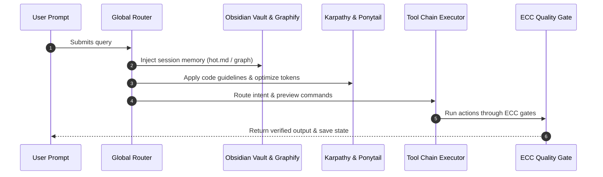

# claude_superstack

<p align="center">
  
</p>

<p align="center">
  
  
  
  
  
</p>

**One command. Ten frameworks. Every project.**

Turns Claude Code into an integrated, memory-backed, self-optimizing dev environment by unifying 10 open-source frameworks under one global router:

| Layer | Repos |
|---|---|
| Knowledge/Memory | [claude-obsidian](https://github.com/AgriciDaniel/claude-obsidian) · [obsidian-skills](https://github.com/kepano/obsidian-skills) · [graphify](https://github.com/Graphify-Labs/graphify) |
| Discipline | [andrej-karpathy-skills](https://github.com/multica-ai/andrej-karpathy-skills) |
| Minimalism / tokens | [ponytail](https://github.com/DietrichGebert/ponytail) |
| Workflow | [superpowers](https://github.com/obra/superpowers) · [gsd-core](https://github.com/open-gsd/gsd-core) |
| Quality | [ECC](https://github.com/affaan-m/ECC) |
| Design | [ui-ux-pro-max-skill](https://github.com/nextlevelbuilder/ui-ux-pro-max-skill) · [open-design](https://github.com/nexu-io/open-design) (optional) |

## Repository Stats (Live Updates)

<!-- STATS_START -->
| Metric | Value | Description |
|---|---|---|
| **SuperStack Version** | `v1.0.0` | Current release version |
| **Integrated Frameworks** | `10` | Unified Claude Code extensions |
| **Automation Scripts** | `4 files` (442 lines) | Core installation & orchestration |
| **Documentation Assets** | `5 guides` | Deep-dives, manuals, and schemas |
| **Last Auto-Updated** | `2026-07-20` | Triggered by latest repository push |
<!-- STATS_END -->

## Install (one line)

**macOS / Linux / WSL**
```bash
curl -fsSL https://raw.githubusercontent.com/shantosaha/claude_superstack/main/install.sh | bash
```

**Windows (PowerShell)**
```powershell
irm https://raw.githubusercontent.com/shantosaha/claude_superstack/main/install.ps1 | iex
```

Checks every repo; installs only what's missing. Add `--with-design` (or `-WithDesign`) to include open-design.

## Install manually (clone + run)

Prefer to clone the repo yourself first? Any of these work:

```bash
# HTTPS
git clone https://github.com/shantosaha/claude_superstack.git

# SSH
git clone git@github.com:shantosaha/claude_superstack.git

# GitHub CLI
gh repo clone shantosaha/claude_superstack
```

Then run the installer from inside it:
```bash
cd claude_superstack
bash install.sh          # macOS / Linux / WSL
# or on Windows:
# powershell -ExecutionPolicy Bypass -File install.ps1
```

## Commands

```bash
superstack install   # install/verify all 10 repos + global router + hooks
superstack init x    # create new project 'x' (vault + graph + config, auto-wired)
superstack migrate . # enable SuperStack on an existing project
superstack doctor    # health-check everything
superstack update    # pull the latest version of every repo
superstack uninstall # remove SuperStack global files
```

## What happens on every prompt



1. **Silent memory injection** — `.vault/hot.md` + graphify graph loaded via SessionStart hook (0 tokens, file reads)
2. **Always-on discipline** — Karpathy guidelines + auto-leveled Ponytail
3. **Intent routing** — your prompt is matched to the right tool chain (plan → design → execute → review)
4. **Preview + confirm** — one line per command before running. `/skip` skips it for that prompt (never for heavy/destructive tasks: >10 files or deletions always confirm)
5. **Execute** — the chain runs with ECC quality gates
6. **Silent memory write** — hot cache + graph updated on session Stop

## In-chat commands

| Command | Effect |
|---|---|
| `/skip` | Skip preview (this prompt only; never heavy/destructive) |
| `/ponytail lite\|full\|ultra\|auto` | Set token/minimalism level (persisted) |
| `/superstack-status` | Show active repos, level, vault health |
| `/save [name]` | File the session into the project vault |

## Per-project layout

```
your-project/
├── CLAUDE.md          # inherits global router
├── .vault/            # this project's Obsidian vault (open in Obsidian app)
├── .graphify/         # this project's code knowledge graph
└── .superstack.json   # per-project config
```

## Requirements
- git, Node.js 20+, Claude Code
- Optional: `uv` or `pipx` (graphify), `pnpm` + Node 24 (open-design)

## Documentation

Detailed documentation and guides are available in the [documents/](documents/) directory:

- [System Deep Dive](documents/SYSTEM-DEEP-DIVE.md) — Comprehensive technical overview of the architecture and global router.
- [User Guide](documents/USER-GUIDE.md) — Step-by-step instructions on setting up and running SuperStack.
- [Web View Interface (Live Webpage)](https://shantosaha.github.io/claude_superstack/documents/superstack-web-view.html) — HTML dashboard/web interface for visual interactions.
- [AI Frameworks Reference](documents/AI-Frameworks-Complete-Reference-10-Repos.pdf) — Complete reference documentation for the 10 unified frameworks.
- [Complete Command List](documents/COMPLETE-COMMAND-LIST.pdf) — Cheat sheet of all CLI tools and framework commands.

## License
MIT for these scripts. Each integrated repo keeps its own license — this project downloads them from their official sources and bundles nothing.
